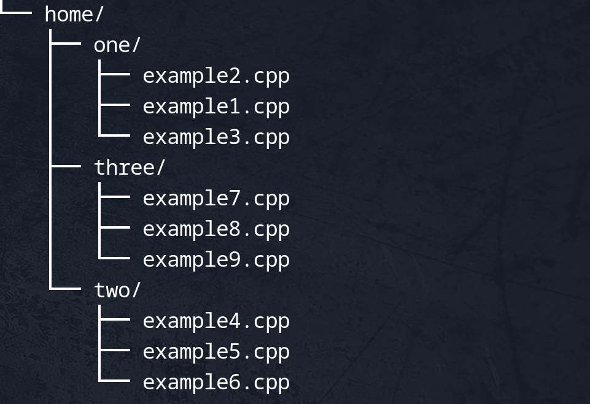

# Project-Scope

**Project-Scope** is a simple utility designed to enhance the way you visualize, share, and manage project structures. With its intuitive tree-like structure visualization, recursive file search, and clipboard integration, Project-Scope simplifies the process of sharing both the structure and content of project files. It’s a versatile tool perfect for developers, technical writers, and teams who need to communicate codebases or easily paste entire project structures and contents into LLMs (AI) for better handling and understanding.

<div align="center">
    
</div>

## Key Features
- **Project(directory) Tree Visualization**: Visualize project directories and file structures in a clean, hierarchical tree format.
- **Selective Recursive File Search**: Specify file types for recursive directory searches, providing flexibility in the types of files you target.
- **Clipboard Integration**: Automatically formats and copies file paths, contents, and tree structures to the clipboard, making it easy to paste into documents or code review tools.
- **Cross-Platform Compatibility**: Works on Linux, macOS, and Windows.
- **Run From Any Directory**: Add **ProjectScope** binary to your system’s PATH so you can run it from any folder, and it will automatically detect your current working directory.
- **Easily Shareable Structures**: Present your project structure or file contents to others in an organized and shareable manner.

## Usage
To use **Project-Scope**, for better usage first add it to your system's PATH so it can be invoked from any directory. Compile and run the program from your terminal or command prompt, specifying file extensions as arguments. The `-r` flag can be used to indicate recursive searching for certain file types, while the `-t` flag will generate and copy a tree-structured view of the entire project directory to your clipboard.

### Adding ProjectScope to Your System PATH
To make **ProjectScope** accessible from any directory, you need to add the compiled binary to your system's PATH.

#### Linux / macOS
1. After building the project, find the location of the compiled binary (e.g., `/path/to/ProjectScope/build/ProjectScope`).
2. Open your shell configuration file (e.g., `.bashrc`, `.zshrc`):
   ```bash
   nano ~/.bashrc
   ```
3. Add the following line, replacing `/path/to/ProjectScope/build` with the actual path where **ProjectScope** is located:
   ```bash
   export PATH=$PATH:/path/to/ProjectScope/build
   ```
4. Save and close the file. Then reload the shell configuration:
   ```bash
   source ~/.bashrc
   ```

#### Windows
1. After building **ProjectScope**, find the location of the compiled binary (e.g., `C:\path\to\ProjectScope\build\ProjectScope.exe`).
2. Open the System Properties by searching for "Environment Variables."
3. Under "System variables," find the `Path` variable, select it, and click "Edit."
4. Add the path to your **ProjectScope** executable (e.g., `C:\path\to\ProjectScope\build`).
5. Click "OK" to close the dialogs, and restart your terminal or command prompt.

### Command Syntax
Once **ProjectScope** is in your PATH, you can run it from any directory:
```bash
ProjectScope [options] <file extensions>
```

### Options
- `-r`: Apply recursive search to file extensions listed after this flag.
- `-t`: Generate a tree-structured view of the project directory.
- `-p`: Print the copied content directly to the terminal.

### Examples
- Search for `.cpp` and `.h` files non-recursively, and for `.txt` and `.md` files recursively:
  ```bash
  ProjectScope .cpp .h -r .txt .md
  ```
- Visualize the project structure as a tree and copy it to the clipboard:
  ```bash
  ProjectScope -t
  ```

## Building the Project
To build **ProjectScope**, follow these steps:

1. **Clone and navigate to the project**:
   ```bash
   git clone https://github.com/iman-zamani/Project-Scope.git
   cd ProjectScope
   ```

2. **Initialize required submodules**:
   ```bash
   git submodule update --init --recursive
   ```

3. **Compile the application**:
   ```bash
   mkdir build && cd build
   cmake ..
   cmake --build .
   ```

4. **Add the compiled binary to your system’s PATH** (see instructions above).

   
## License
This project is licensed under the MIT License - see the [LICENSE](LICENSE) file for details.


